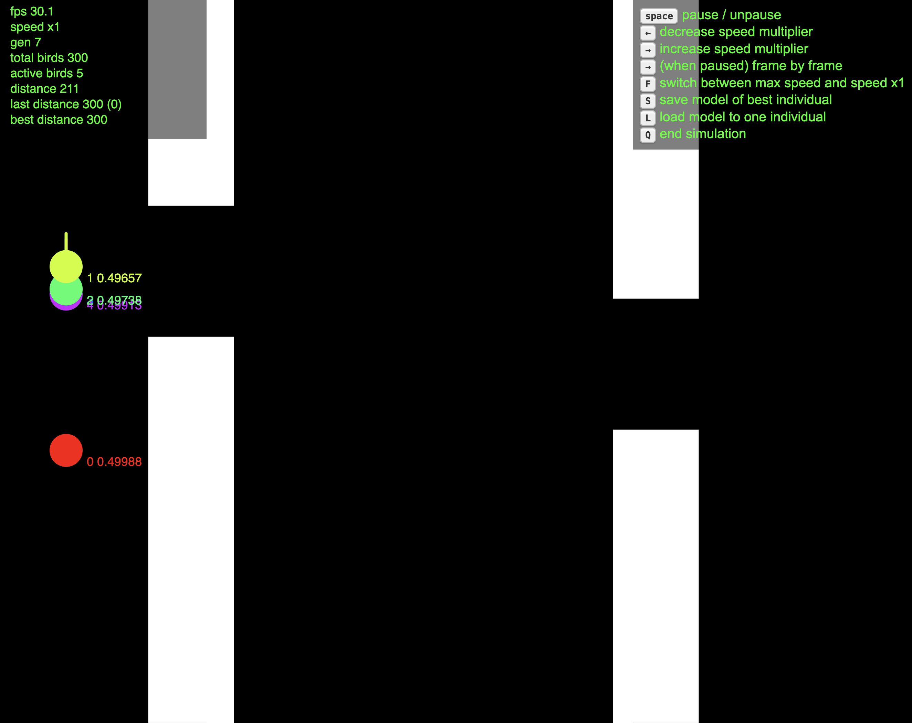

# AI learns to play flappy bird

**Attempt** to create a simple **neural network** which learns to **play flappy bird**.

The learning process is facilitated through the use of a **genetic algorithm**.

Highly inspired by [perceptron](https://natureofcode.com/neural-networks/#the-perceptron) and [genetic algorithm](https://natureofcode.com/genetic-algorithms/#coding-the-genetic-algorithm).

## screenshot


## How to run
```shell
npm ci
npm run dev
```